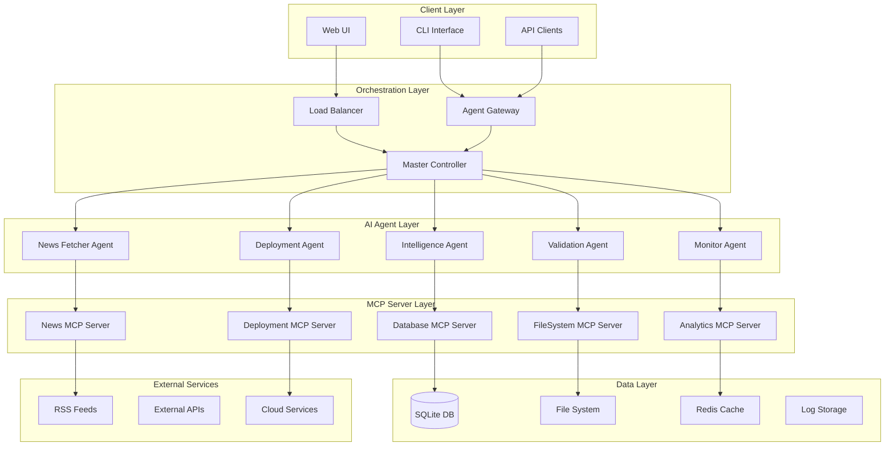

# MCP Server AI Agent Orchestration - Architecture Reference

## Executive Summary

This document outlines the complete architecture for a production-ready MCP (Model Context Protocol) Server AI Agent Orchestration system designed for automated news intelligence gathering, processing, and deployment. The system leverages multiple AI agents working in coordination to achieve rapid build, deployment validation, and production readiness.

## Architecture Overview



## Component Architecture

### 1. Master Controller (Orchestrator Core)

**Purpose**: Central coordination hub for all AI agents and MCP servers
**Location**: `src/orchestrator/master-controller.js`

**Responsibilities**:

- Agent lifecycle management
- Task distribution and scheduling
- Inter-agent communication
- Global state management
- Error handling and recovery
- Performance monitoring

**Key Features**:

- Event-driven architecture
- Circuit breaker pattern
- Auto-scaling capabilities
- Health monitoring
- Graceful degradation

### 2. AI Agent Layer

#### a) News Fetcher Agent

**Purpose**: Automated news collection and preprocessing

**Capabilities**:

- Multi-source RSS feed monitoring
- Content deduplication
- Real-time processing
- Quality scoring
- Source reliability assessment

#### b) Intelligence Agent

**Purpose**: Advanced content analysis and insights generation

**Capabilities**:

- Natural language processing
- Sentiment analysis
- Trend detection
- Crisis pattern recognition
- Automated categorization

#### c) Deployment Agent

**Purpose**: Automated deployment and infrastructure management

**Capabilities**:

- Environment provisioning
- Automated testing
- Blue-green deployments
- Rollback management
- Performance optimization

#### d) Validation Agent

**Purpose**: Continuous testing and quality assurance

**Capabilities**:

- Unit test execution
- Integration testing
- Performance testing
- Security scanning
- Compliance validation

#### e) Monitor Agent

**Purpose**: System monitoring and alerting

**Capabilities**:

- Real-time metrics collection
- Anomaly detection
- Automated alerting
- Performance analytics
- Predictive maintenance

### 3. MCP Server Layer

#### Enhanced Multi-Protocol Support

- **HTTP/HTTPS**: REST API endpoints
- **WebSocket**: Real-time bidirectional communication
- **SSE**: Server-sent events for live updates
- **STDIO**: Direct process communication

#### Server Specifications

| Server | Port | Protocol | Purpose |
|--------|------|----------|---------|
| News MCP | 3006 | HTTP/SSE | News operations |
| FileSystem MCP | 3007 | STDIO | File operations |
| Database MCP | 3008 | HTTP | Data operations |
| Analytics MCP | 3009 | WebSocket | Real-time analytics |
| Deployment MCP | 3010 | HTTP | Deployment operations |

## Rapid Build Strategy

### 1. Containerized Development Environment

```dockerfile
# Base development container
FROM node:18-alpine
WORKDIR /app
COPY package*.json ./
RUN npm ci --only=production
COPY . .
EXPOSE 3006-3010
CMD ["npm", "run", "orchestrator:start"]
```

### 2. Automated Build Pipeline

**Build Stages**:

1. **Dependency Resolution**: Smart caching and parallel installation
2. **Code Compilation**: TypeScript to JavaScript transpilation
3. **Asset Optimization**: Minification and bundling
4. **Container Building**: Multi-stage Docker builds
5. **Testing Integration**: Automated test execution
6. **Artifact Generation**: Deployment-ready packages

### 3. Development Acceleration Tools

```json
{
  "scripts": {
    "dev:orchestrator": "concurrently \"npm run mcp:start\" \"npm run agents:start\" \"npm run monitor:start\"",
    "build:rapid": "npm run build:parallel && npm run test:fast && npm run package:optimize",
    "deploy:staging": "npm run build:rapid && npm run deploy:validate && npm run deploy:execute",
    "deploy:production": "npm run validate:production && npm run deploy:blue-green"
  }
}
```

## Deployment Validation Framework

### 1. Multi-Stage Validation Pipeline

#### Stage 1: Unit Validation

- **Agent Unit Tests**: Individual agent functionality
- **MCP Server Tests**: Protocol compliance testing
- **Integration Tests**: Inter-component communication
- **Performance Tests**: Load and stress testing

#### Stage 2: Environment Validation

- **Configuration Validation**: Environment-specific settings
- **Dependency Validation**: Service availability
- **Security Validation**: Vulnerability scanning
- **Compliance Validation**: Regulatory requirements

#### Stage 3: Operational Validation

- **Health Check Validation**: All services responsive
- **Data Flow Validation**: End-to-end data processing
- **Failover Validation**: Disaster recovery testing
- **Performance Validation**: SLA compliance

### 2. Automated Testing Matrix

| Test Type | Scope | Frequency | Automation Level |
|-----------|-------|-----------|------------------|
| Unit | Individual components | Every commit | 100% |
| Integration | Component interactions | Every PR | 95% |
| System | End-to-end workflows | Daily | 90% |
| Performance | Load/stress testing | Weekly | 85% |
| Security | Vulnerability scanning | Daily | 100% |

## Production Readiness Checklist

### 1. Infrastructure Requirements

#### Minimum System Requirements

- **CPU**: 4 cores (8 recommended)
- **RAM**: 8GB (16GB recommended)
- **Storage**: 100GB SSD (500GB recommended)
- **Network**: 1Gbps (10Gbps recommended)

#### Recommended Cloud Configuration

```yaml
infrastructure:
  compute:
    type: "Standard_D4s_v3"
    cpu: 4
    memory: "16GB"
    storage: "500GB SSD"
  
  networking:
    load_balancer: true
    auto_scaling: true
    cdn: true
  
  monitoring:
    metrics: "Azure Monitor / CloudWatch"
    logging: "ELK Stack / Splunk"
    alerting: "PagerDuty / Slack"
```

### 2. Security Framework

#### Authentication & Authorization

- **API Authentication**: JWT tokens with refresh mechanism
- **Role-Based Access Control (RBAC)**: Granular permissions
- **Service-to-Service Auth**: Mutual TLS (mTLS)
- **Secret Management**: HashiCorp Vault / Azure Key Vault

#### Data Protection

- **Encryption at Rest**: AES-256
- **Encryption in Transit**: TLS 1.3
- **Data Anonymization**: PII scrubbing
- **Backup Encryption**: End-to-end encrypted backups

### 3. Monitoring & Observability

#### Metrics Collection

```javascript
const metrics = {
  system: ['cpu_usage', 'memory_usage', 'disk_usage', 'network_io'],
  application: ['request_rate', 'error_rate', 'response_time', 'throughput'],
  business: ['news_articles_processed', 'intelligence_reports_generated', 'user_engagement']
};
```

#### Alerting Rules

- **Critical**: Service unavailable, data loss, security breach
- **Warning**: High resource usage, slow response times, unusual patterns
- **Info**: Deployment events, configuration changes, scheduled maintenance

## Technology Stack

### Core Technologies

- **Runtime**: Node.js 18+ (LTS)
- **Language**: JavaScript/TypeScript
- **Framework**: Express.js + FastAPI
- **Database**: SQLite (dev) / PostgreSQL (prod)
- **Cache**: Redis
- **Message Queue**: Redis Pub/Sub / RabbitMQ

### AI/ML Libraries

- **NLP**: Natural (Node.js) / spaCy (Python)
- **Analytics**: TensorFlow.js / scikit-learn
- **Monitoring**: Prometheus + Grafana
- **Orchestration**: Docker Compose / Kubernetes

### DevOps Tools

- **CI/CD**: GitHub Actions / Azure DevOps
- **Infrastructure**: Terraform / ARM Templates
- **Monitoring**: ELK Stack / Azure Monitor
- **Security**: Snyk / SonarQube

## File Structure

```text
news/
├── src/
│   ├── orchestrator/
│   │   ├── master-controller.js
│   │   ├── agent-manager.js
│   │   ├── task-scheduler.js
│   │   └── health-monitor.js
│   ├── agents/
│   │   ├── news-fetcher-agent.js
│   │   ├── intelligence-agent.js
│   │   ├── deployment-agent.js
│   │   ├── validation-agent.js
│   │   └── monitor-agent.js
│   ├── mcp-servers/
│   │   ├── news-mcp-server.js
│   │   ├── filesystem-mcp-server.js
│   │   ├── database-mcp-server.js
│   │   ├── analytics-mcp-server.js
│   │   └── deployment-mcp-server.js
│   ├── shared/
│   │   ├── utils/
│   │   ├── middleware/
│   │   ├── validators/
│   │   └── constants/
│   └── config/
│       ├── development.json
│       ├── staging.json
│       └── production.json
├── tests/
│   ├── unit/
│   ├── integration/
│   ├── e2e/
│   └── performance/
├── deployment/
│   ├── docker/
│   ├── kubernetes/
│   ├── terraform/
│   └── scripts/
├── monitoring/
│   ├── dashboards/
│   ├── alerts/
│   └── metrics/
└── docs/
    ├── api/
    ├── architecture/
    ├── deployment/
    └── troubleshooting/
```

## Implementation Phases

### Phase 1: Foundation (Week 1)

- [ ] Set up orchestrator core architecture
- [ ] Implement basic agent framework
- [ ] Create MCP server foundation
- [ ] Establish development environment
- [ ] Set up CI/CD pipeline

### Phase 2: Core Functionality (Week 2)

- [ ] Implement News Fetcher Agent
- [ ] Build Intelligence Agent
- [ ] Create database integration
- [ ] Add monitoring capabilities
- [ ] Implement basic validation

### Phase 3: Advanced Features (Week 3)

- [ ] Deployment automation
- [ ] Advanced analytics
- [ ] Performance optimization
- [ ] Security hardening
- [ ] Load balancing

### Phase 4: Production Readiness (Week 4)

- [ ] Comprehensive testing
- [ ] Documentation completion
- [ ] Performance tuning
- [ ] Security audit
- [ ] Production deployment

## Success Metrics

### Technical KPIs

- **Deployment Time**: < 5 minutes
- **Test Coverage**: > 90%
- **System Uptime**: > 99.9%
- **Response Time**: < 100ms (95th percentile)
- **Error Rate**: < 0.1%

### Business KPIs

- **News Processing Rate**: > 1000 articles/hour
- **Intelligence Reports**: 24/7 automated generation
- **Cost Efficiency**: 40% reduction in manual operations
- **Time to Market**: 75% faster feature deployment

## Risk Mitigation

### Technical Risks

- **Single Point of Failure**: Implement redundancy and failover
- **Performance Degradation**: Auto-scaling and optimization
- **Data Loss**: Automated backups and replication
- **Security Vulnerabilities**: Regular audits and updates

### Operational Risks

- **Staff Dependencies**: Documentation and automation
- **Vendor Lock-in**: Multi-cloud and open-source strategy
- **Compliance Issues**: Automated compliance checking
- **Budget Overruns**: Cost monitoring and alerts

## Next Steps

1. **Immediate Actions** (Next 24 hours):

   - Initialize orchestrator core
   - Set up development environment
   - Create basic agent templates
   - Establish monitoring foundation

2. **Short-term Goals** (Next Week):

   - Complete Phase 1 implementation
   - Begin Phase 2 development
   - Set up automated testing
   - Create deployment pipeline

3. **Long-term Objectives** (Next Month):

   - Full production deployment
   - Performance optimization
   - Advanced feature implementation
   - Comprehensive documentation

---

**Document Version**: 1.0  
**Last Updated**: {timestamp}  
**Next Review**: {next_review_date}  
**Owner**: DevOps Automation Team  
**Stakeholders**: Development, Operations, Security, Business
